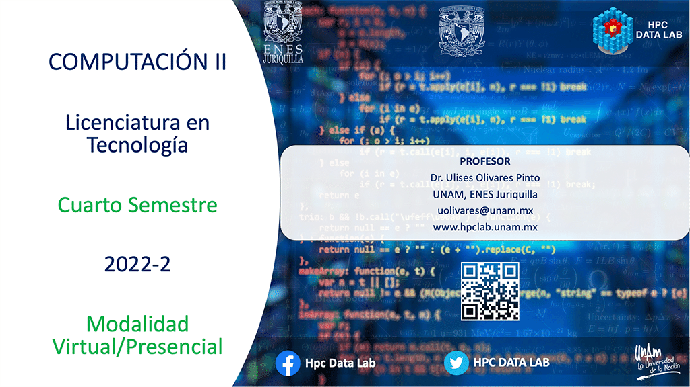

# Licenciatura en Tecnología - Computación II

## Semestre 2022-2

## Profesor
> ### Dr. Ulises Olivares Pinto

## Objetivo
El estudiante analizará y comprenderá distintos métodos numéricos para la resolución de problemas en el ámbito científico.

# Código en Clase
| No.        | Tema           | Conceptos |Código  |  Material complementario|
| :-------------: |:-------------| :-------------|:-----:| :-----|
| 1.              | Introducción a la POO en Python |   <ul><li> POO </li> <li>Librerías</li> <li>Método gráfico</li> </ul>   |  [Código Google Colab](code/Computación_II_(2022_2)_UNIDAD_I_.ipynb)   |  | 
| 2.              | Resolución de sistemas de ecuaciones algebraicas lineales |   <ul><li> Eliminación Gaussiana</li> <li>Método de Gauss-Jordan</li> <li>Método gráfico</li> </ul>   |     | Capítulo 9 - Numerical Methods, Steven Chapra | 
| 3.              | Raices de polinomios |   <ul><li> Método de la bisección </li>  </ul>   |     | Capítulo 5 - Numerical Methods, Steven Chapra | 
| 4.              | Interpolación |   <ul><li> Interpolación de Newton</li> <li> Interpolación de Lagrange</li> <li> Interpolación Spline</li>  </ul>   |     | Capítulo  | 

# Prácticas

|Práctica|Temas|Recursos|Fecha|
|--|--|--|--|
|1.Eliminación Gaussiana (aplicaciones)|<ol><li>Operaciones Fundamentales</li><li>Eliminación Gaussiana</li><li>POO con Python</li></ol>|<ul><li></li> <li>[POO con Python](https://uniwebsidad.com/libros/python/capitulo-5/programacion-orientada-a-objetos) </li></ul>
|2. Raices de polinomios)|<ol><li>El método de la bisección</li></ol>|<ul><li></li> </ul>

Última modificación: **2 de febrero de 2022**
